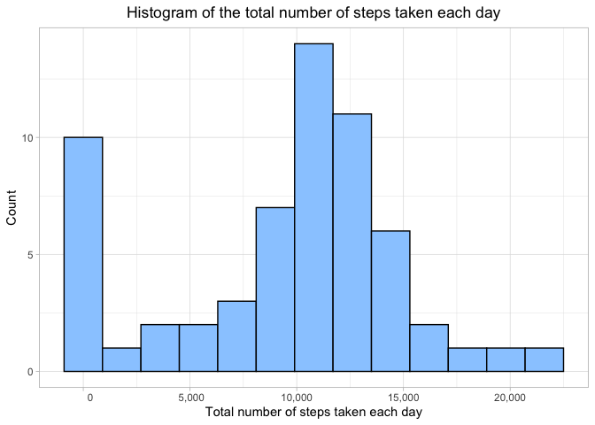

## Loading and preprocessing the data


```r
library(lubridate)
library(dplyr)
library(ggplot2)
library(stringr)

fileURL = 'https://github.com/rdpeng/RepData_PeerAssessment1/raw/master/activity.zip'
download.file(url = fileURL, destfile = 'activity.zip')
unzip('activity.zip')

activity <- read.csv('activity.csv')

activity$date <- ymd(activity$date)
```

## What is mean total number of steps taken per day?


```r
totalStepsByDate <- 
    group_by(activity, date) %>%
    summarize(totalsteps = sum(steps, na.rm = TRUE))

ggplot(totalStepsByDate, aes(x = totalsteps)) +
    geom_histogram(binwidth = 1800, fill = '#99ccff', color = 'black') +
    theme_light() +
    scale_x_continuous(labels = function(x) format(x, big.mark = ',')) +
    labs(x = 'Total number of steps taken each day', y = 'Count') +
    ggtitle('Histogram of the total number of steps taken each day') +
    theme(plot.title = element_text(hjust = 0.5))
```

<!-- -->


```r
meanTotalStepsPerDay <- mean(totalStepsByDate$totalsteps)
medianTotalStepsPerDay <- median(totalStepsByDate$totalsteps)
summary(totalStepsByDate$totalsteps)[c('Mean', 'Median')]
```

```
##     Mean   Median 
##  9354.23 10395.00
```

The mean and median of the total number of steps taken per day are 9,354.23 and 10,395.

## What is the average daily activity pattern?


```r
averageStepsByInterval <- 
    group_by(activity, interval) %>% 
    summarize(averagesteps = mean(steps, na.rm = TRUE))

ggplot(averageStepsByInterval, aes(x = interval, y = averagesteps)) +
    geom_line(color = '#0066cc') +
    theme_light() +
    labs(x = '5-minute interval', y = 'Average number of steps taken') +
    ggtitle('Average daily activity pattern') +
    theme(plot.title = element_text(hjust = 0.5)) +
    scale_x_continuous(labels = function(x) {
        s <- str_pad(x, 4, side = 'left', pad = '0')
        paste(str_sub(s, start=1, end=2), str_sub(s, start=3, end=4), sep = ':')
    })
```

<!-- -->


```r
intervalWithMaxSteps <- arrange(averageStepsByInterval
                                , desc(averagesteps))[[1, 1]]

intervalWithMaxSteps <- str_pad(intervalWithMaxSteps, 4, side = 'left'
                                , pad = '0')
intervalWithMaxSteps <- paste(str_sub(intervalWithMaxSteps, start=1, end=2)
                              , str_sub(intervalWithMaxSteps, start=3, end=4)
                              , sep = ':')
```

The 5-minute interval, on average across all the days in the dataset, which contains the maximum number of steps is at 08:35.

## Imputing missing values


```r
totalMissingValues <- sum(is.na(activity$steps))
```

The total number of missing values in the dataset is 2304.

For the rows with missing value, I will use the mean for that 5-minute interval to fill in the missing value.


```r
activityNoMissing <- 
    merge(activity, averageStepsByInterval, by = 'interval') %>%
    mutate(steps = ifelse(is.na(steps), round(averagesteps,0), steps)) %>%
    select(steps, date, interval) %>%
    arrange(date, interval)
```

I will make a histogram using the new dataset with the missing data filled in.


```r
totalStepsByDate2 <- 
    group_by(activityNoMissing, date) %>% 
    summarize(totalsteps = sum(steps))

ggplot(totalStepsByDate2, aes(x = totalsteps)) +
    geom_histogram(binwidth = 1800, fill = '#99ccff', color = 'black') +
    theme_light() +
    scale_x_continuous(labels = function(x) format(x, big.mark = ',')) +
    labs(x = 'Total number of steps taken each day', y = 'Count') +
    ggtitle('Histogram of the total number of steps taken each day') +
    theme(plot.title = element_text(hjust = 0.5))
```

<!-- -->


```r
meanTotalStepsPerDay2 <- mean(totalStepsByDate2$totalsteps)
medianTotalStepsPerDay2 <- median(totalStepsByDate2$totalsteps)
summary(totalStepsByDate2$totalsteps)[c('Mean', 'Median')]
```

```
##     Mean   Median 
## 10765.64 10762.00
```

The mean and median of the total number of steps taken per day are now 10,765.64 and 10,762.

## Are there differences in activity patterns between weekdays and weekends?


```r
activityNoMissing <- 
    mutate(activityNoMissing
           , day = factor(ifelse(weekdays(date) %in% c('Saturday', 'Sunday')
                                 , 'weekend', 'weekday'
                                 )
                          )
           )

averageStepsByDayInterval <- 
    group_by(activityNoMissing, day, interval) %>% 
    summarize(averagesteps = mean(steps))

ggplot(averageStepsByDayInterval, aes(x = interval, y = averagesteps)) +
    geom_line(color = '#0066cc') +
    facet_wrap(vars(day), ncol = 1) +
    theme_light() +
    labs(x = '5-minute interval', y = 'Average number of steps taken') +
    ggtitle('Activity patterns between weekdays and weekends') +
    theme(plot.title = element_text(hjust = 0.5)
          , strip.background = element_rect(fill = '#0066cc')
          , strip.text = element_text(size = 12)
          , panel.grid.minor = element_blank()) +
    scale_x_continuous(labels = function(x) {
        s <- str_pad(x, 4, side = 'left', pad = '0')
        paste(str_sub(s, start=1, end=2)
              , str_sub(s, start=3, end=4)
              , sep = ':')
    })
```

<!-- -->

